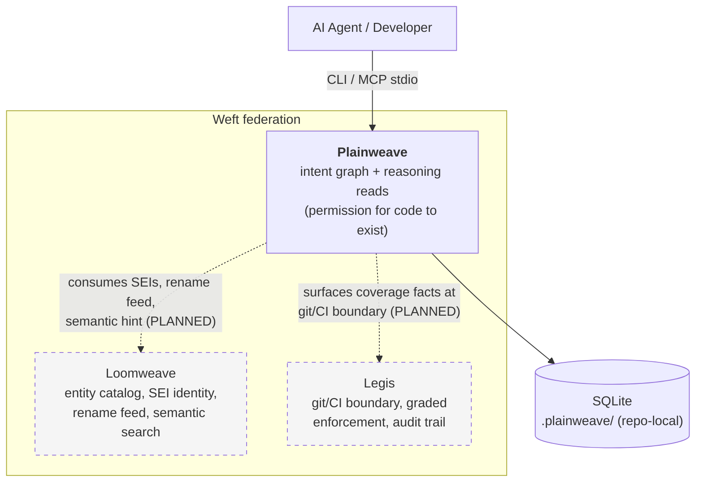
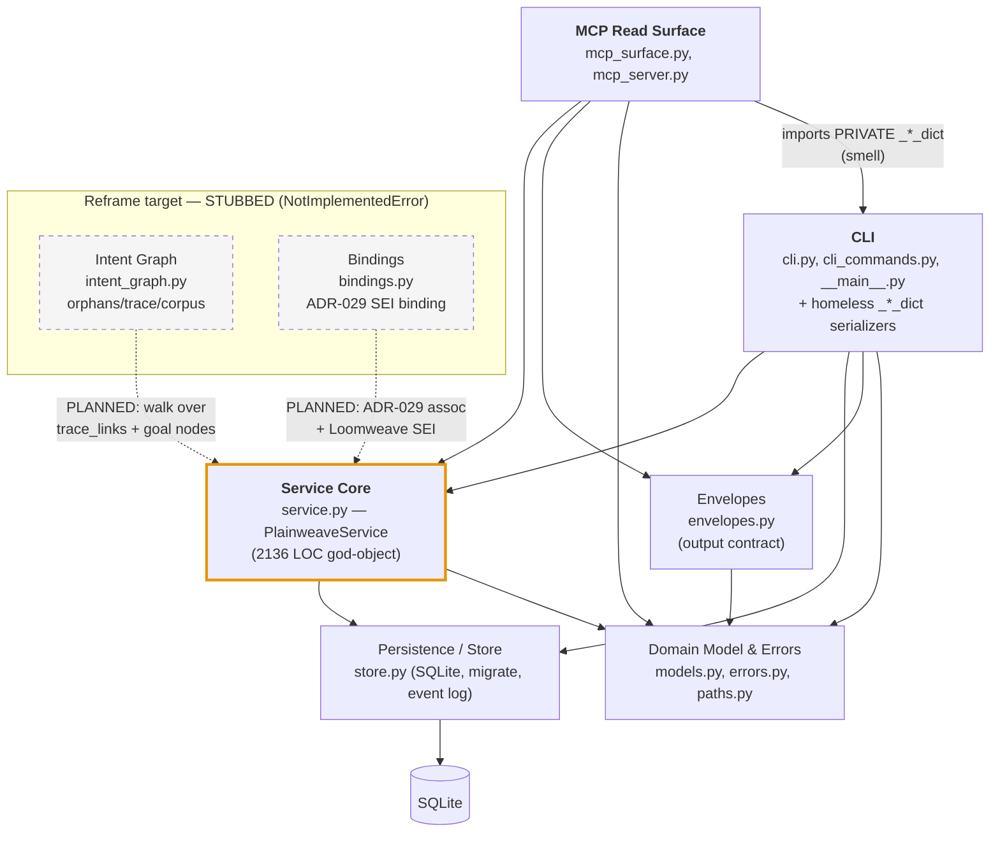
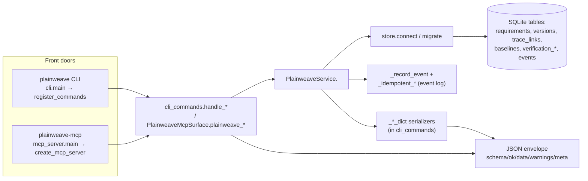
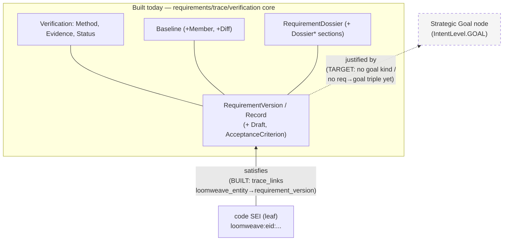

# 03 — Architecture Diagrams (C4)

*Mermaid C4-style diagrams. Solid arrows = direct import/call dependency
(import-confirmed). Dashed = planned/unbuilt (reframe). Diagrams reflect the
**as-built** structure at HEAD `72e8df2`; reframe targets are marked.*

## C1 — System Context

Plainweave in the Weft federation. Plainweave is advisory/enrich-only; siblings
are optional (absent → honest degradation).

> Today Plainweave is self-contained (one runtime dep: the MCP SDK; local
> SQLite). The Loomweave/Legis seams are *additive, hub-blessed, prove-the-need*
> and not yet wired.

## C2 — Container / Module view

The six subsystems and their import-confirmed dependencies.

**Read this diagram for two things:**
1. **`mcp ──► cli`** (red): the MCP surface depends on *private* serializers in
   the CLI module — a layering inversion. Both front doors should depend on a
   neutral `serializers`/`views` module instead.
2. **`svc` (god-object, orange):** every front door funnels through one
   2136-LOC class, and both reframe stubs point back at it — the intent graph is
   on a trajectory to be absorbed into the god-object unless it is decomposed
   first.

## C3 — Component view: the as-built request path

How a single operation flows (e.g. `create_requirement` / a requirement read).

## C4 — Domain model (intent ladder: built vs. target)

**Key:** the *lower* half of the intent ladder (`code → requirement`) is modeled
today in the generic `trace_links` edge table. The *upper* half
(`requirement → goal`) — the reframe's defining edge — has **no node kind and no
relation triple** in the as-built validation set (`_validate_trace_relation`,
`service.py:1877`). The storage substrate is reusable; the graph behavior is
net-new.

## Legend

| Marker | Meaning |
| --- | --- |
| solid arrow | import/call dependency, confirmed in source |
| dashed arrow / grey box | planned (reframe), not implemented |
| red edge | architectural smell (layering inversion) |
| orange node | god-object / dominant risk |
