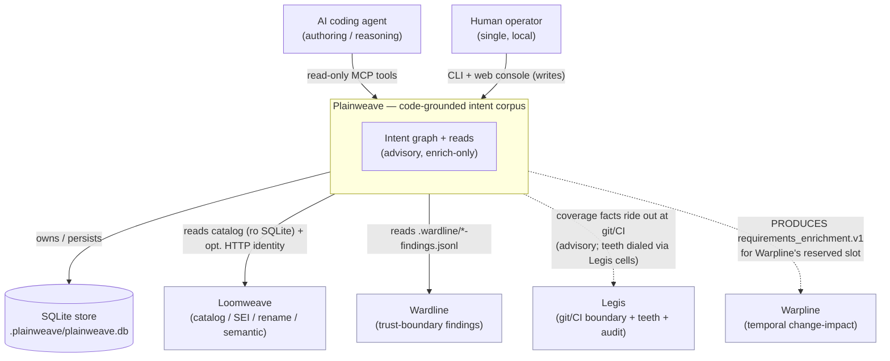
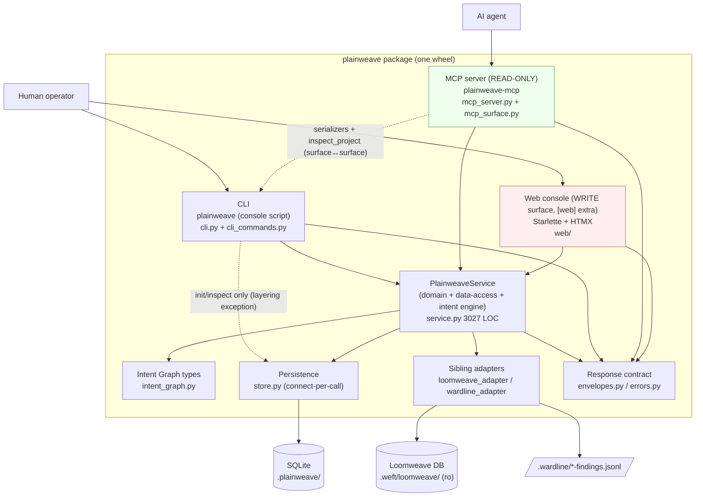
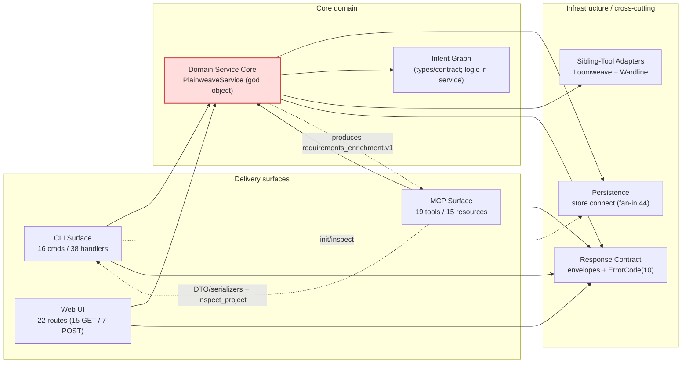
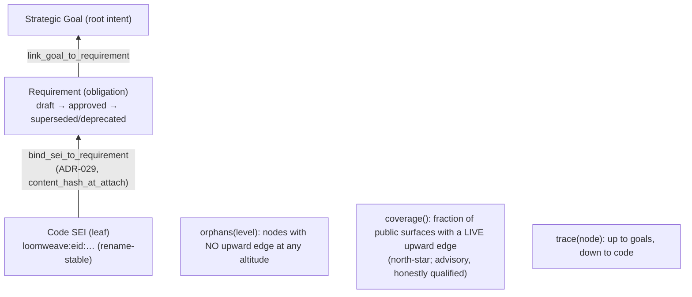
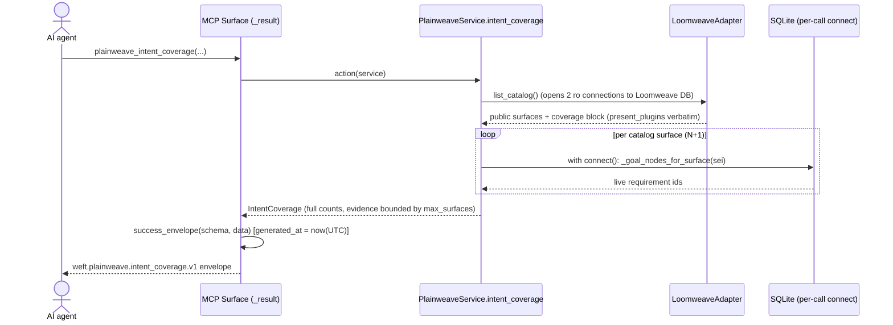
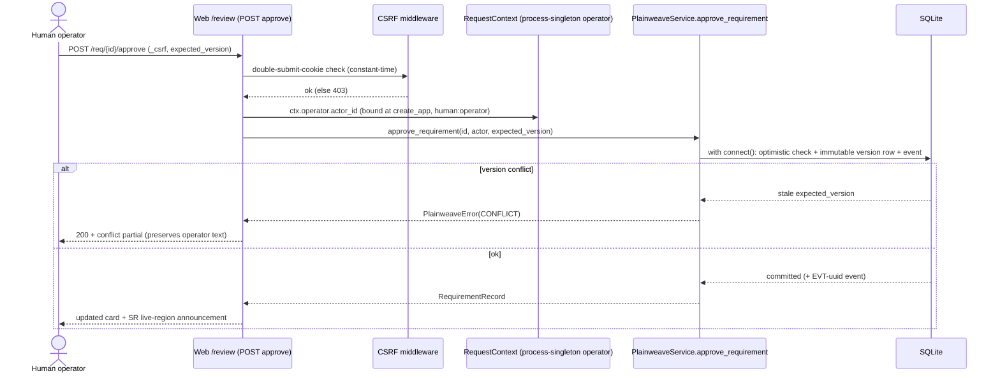

# 03 — Architecture Diagrams (C4-style)

**Subject:** Plainweave · **Live tree:** HEAD `8258f76` · **Date:** 2026-06-28
Diagrams encode the Loomweave-verified dependency map
(`temp/dependency-reconciliation.md`). Mermaid `flowchart`/`sequenceDiagram`
syntax (portable rendering); the C4 level is noted per diagram.

---

## 1. System Context (C4 L1) — who uses Plainweave and what it touches

**Reading:** Plainweave is a *thin* member. It owns the intent graph + reads and
its own SQLite store; it **reads** Loomweave and Wardline local artifacts
(enrich-only), and **produces** facts that Legis (at the git/CI boundary) and
Warpline (its enrichment slot) consume. Dotted edges are enrich/produce seams
that never gate.

---

## 2. Container (C4 L2) — the deployable pieces

**Reading:** Three surfaces, one service, one store. The MCP server is read-only;
the **web console is the only write surface**. Two dotted edges are the
architectural exceptions: the CLI hits the store directly for `init`/`inspect`,
and the MCP surface reaches back into `cli_commands` for serializers +
`inspect_project` (a function-local coupling — **no module-load cycle**).

---

## 3. Component (C4 L3) — the 8 subsystems and their edges

**Reading:** Every surface depends on the Domain Service Core and the Response
Contract; the core fans out to Persistence, Intent Graph, and the Adapters. The
red node is the 3027-LOC god object that is simultaneously use-case tier,
data-access tier, and intent-graph engine — the dominant refactor target.

---

## 4. The intent graph data model (the product's reason to exist)

**Reading:** Edges mean *"justified by / satisfies."* A node with no upward edge
is a reviewable question. `coverage()` counts **live** justification only
(excludes deprecated); `trace()` still *explains* deprecated links — "trace
explains, coverage counts" (`service.py:1537-1539`).

---

## 5. Sequence — MCP `intent_coverage` read (illustrates connect-per-call / N+1)

**Reading:** Each catalog surface opens its **own** SQLite connection inside the
loop (`service.py:1529-1550`) — the confirmed N+1 / connect-per-call pattern.
Combined with no WAL (`DELETE` journal mode), concurrent surfaces serialize on
the writer lock. Correct and honest at single-operator scale; the scaling risk
the two open P3 tracker tasks name.

---

## 6. Sequence — Web write (ratify a draft) showing the sole mutation path

**Reading:** Writes flow only through the web console → service. Identity is a
launch-time process singleton (no per-request auth); CSRF is the sole
request-level control. Optimistic concurrency surfaces `CONFLICT` as a 200 HTMX
partial that preserves the operator's text — a deliberate UX choice.
