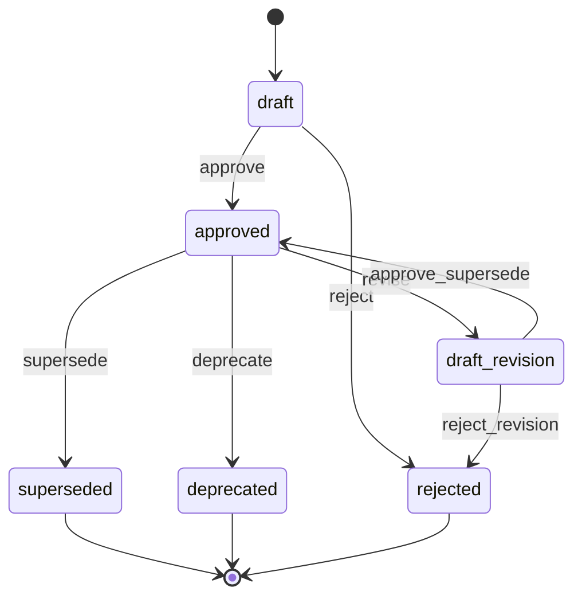
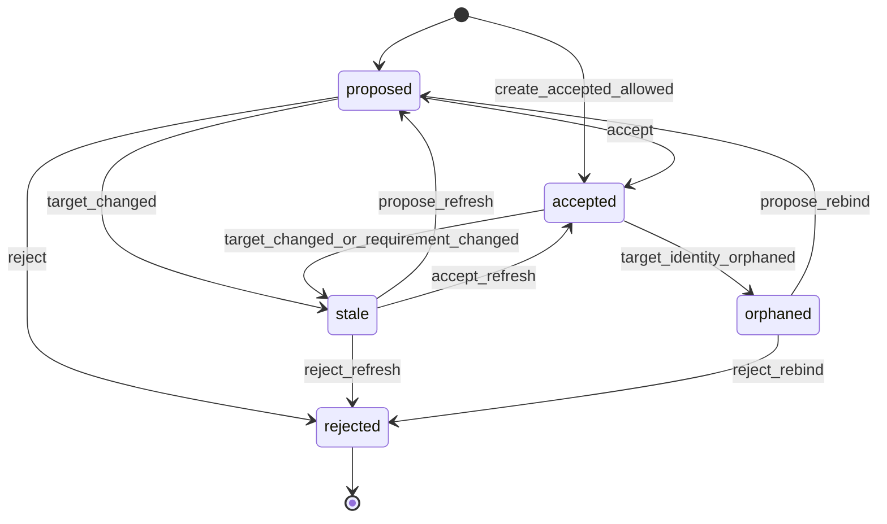

# Charter Interface Contract Hardening

## 1. Purpose

This document hardens the Charter planning pack into implementation-grade
interfaces. It narrows scope to the contracts that prevent Charter from stealing
peer authority, fabricating traceability, or coupling the Loom federation through
implicit assumptions.

Scope is limited to:

1. requirement and version lifecycle state machines;
2. trace-link ontology and state transitions;
3. MCP tool schemas with side-effect metadata;
4. CLI JSON envelopes;
5. federation capability negotiation;
6. Clarion SEI link contract;
7. Filigree gap-to-work contract;
8. Wardline finding-to-requirement contract;
9. Legis preflight fact envelope;
10. v0.1 through v1.0 implementation slices.

Future scoped-change execution tools, including Shuttle if it later enters Loom,
are out of scope here.

## 2. Adversarial Senior User Follow-Up

The first interview validated the product direction. This pass pressure-tests
the failure modes.

| Question | Senior User Answer | Design Consequence |
|---|---|---|
| What would make you uninstall Charter after a week? | "If every commit produces a wall of obvious requirements noise, or if I spend more time accepting links than coding." | Impact output must rank direct accepted links above inferred/nearby links. Neighborhood expansion is opt-in. Link review queues must batch. |
| Where would Charter slow agents down? | "If agents must ask before proposing every link, or if mutations are not clearly retry-safe." | Agents may propose freely. MCP tools expose side-effect metadata, idempotency keys, and dry-run where useful. |
| Which links would you refuse to maintain manually? | "Low-risk test-to-requirement links once the test naming is clear. I will manually review security/safety code links and finding violation links." | Policy defaults allow proposed or auto-accepted low-criticality test links; high/security/safety entity and finding links remain proposed until accepted. |
| When should Charter shut up? | "When a changed file has no accepted or nearby requirement links and the project policy does not require traceability there. Don't invent urgency." | Impact reports separate `untraced_change` info from verification/finding facts. Advisory noise is capped and grouped. |
| What Chill reports become unbearable on every commit? | "Huge baseline diffs, all proposed links, and stale findings from old scans." | Legis preflight facts include only scoped impact, current accepted/proposed counts, and freshness warnings. Full baseline and proposal lists stay behind drill-down tools. |
| What makes Charter too weak? | "If issue closure marks requirements satisfied, if waived findings vanish, or if SEI orphaning is buried." | Satisfaction is evidence-derived. Waived findings remain visible. SEI orphaning creates explicit stale/orphaned links and gaps. |

## 3. Cross-Cutting Contract Rules

### 3.1 Standard Success Envelope

Every CLI `--json`, MCP tool, and federation response uses this envelope unless
the protocol itself requires a different wrapper:

```json
{
  "schema": "weft.charter.<object>.v1",
  "ok": true,
  "data": {},
  "warnings": [],
  "meta": {
    "producer": {"tool": "charter", "version": "0.1.0"},
    "generated_at": "2026-06-04T10:00:00+10:00",
    "project": "AUTH"
  }
}
```

### 3.2 Standard Error Envelope

```json
{
  "schema": "weft.charter.error.v1",
  "ok": false,
  "error": {
    "code": "VALIDATION",
    "message": "requirement_id is required",
    "recoverable": true,
    "hint": "Pass an approved requirement id such as REQ-AUTH-017.",
    "details": {}
  },
  "warnings": [],
  "meta": {
    "producer": {"tool": "charter", "version": "0.1.0"},
    "generated_at": "2026-06-04T10:00:00+10:00",
    "project": "AUTH"
  }
}
```

### 3.3 Error Codes

| Code | Meaning | Recoverable | Agent Recovery |
|---|---|---:|---|
| `VALIDATION` | Input failed schema or domain validation. | Yes | Correct input and retry. |
| `NOT_FOUND` | Requested local object does not exist. | Yes | Search/list before retrying. |
| `CONFLICT` | Expected version/status/idempotency conflict. | Yes | Refetch object and retry with current version. |
| `POLICY_REQUIRED` | Human acceptance or configured policy is required. | Yes | Create/propose instead of accepting directly. |
| `PEER_ABSENT` | Optional peer is not installed or not configured. | Yes | Fall back to local/fragile mode. |
| `PEER_STALE` | Peer data exists but is older than requested scope. | Yes | Refresh peer or proceed with stale warning. |
| `PEER_CONTRACT` | Peer response did not match expected contract. | Yes | Report diagnostics; do not trust peer fact. |
| `LOCKED` | Baseline or approved version is immutable. | Yes | Supersede or create a new draft. |
| `UNSUPPORTED` | Operation is not supported in current capability set. | Yes | Probe capabilities and choose fallback. |
| `INTERNAL` | Unexpected Charter failure. | Maybe | Retry once; then report with event/request id. |

### 3.4 Freshness And Authority Labels

Every fact crossing a surface that an agent or peer consumes carries:

```json
{
  "authority": "accepted",
  "freshness": "current",
  "source": {"kind": "charter", "ref": "REQ-AUTH-017@3"}
}
```

Allowed `authority` values:

- `accepted`: accepted Charter project truth.
- `agent_proposed`: proposed by an agent, not accepted.
- `human_proposed`: proposed by a human, not accepted.
- `inferred`: deterministic inference, not accepted truth.
- `imported`: imported from external source.
- `test_derived`: derived from test result import.
- `peer_reported`: reported by a Loom peer.

Allowed `freshness` values:

- `current`
- `stale`
- `unknown`
- `orphaned`
- `not_applicable`

No JSON contract may omit both `authority` and `freshness` for a trace,
verification, peer fact, gap, or impact item.

## 4. Requirement And Version Lifecycle

### 4.1 Storage Separation

Approved requirement text must not live in the mutable identity row.

```text
requirements
  stable identity, display id, current pointers, aggregate status only

requirement_drafts
  mutable draft content and proposed edits

requirement_versions
  immutable approved content
```

Tables:

```text
requirements(
  id TEXT PRIMARY KEY,
  stable_id TEXT NOT NULL UNIQUE,
  current_version INTEGER,
  active_draft_id TEXT,
  status TEXT NOT NULL,
  type TEXT,
  criticality TEXT,
  owner TEXT,
  source TEXT,
  created_at TEXT NOT NULL,
  updated_at TEXT NOT NULL
)

requirement_drafts(
  draft_id TEXT PRIMARY KEY,
  requirement_id TEXT NOT NULL,
  base_version INTEGER,
  title TEXT NOT NULL,
  statement TEXT NOT NULL,
  rationale TEXT,
  draft_status TEXT NOT NULL,
  created_by TEXT NOT NULL,
  created_at TEXT NOT NULL,
  updated_at TEXT NOT NULL
)

requirement_versions(
  requirement_id TEXT NOT NULL,
  version INTEGER NOT NULL,
  title TEXT NOT NULL,
  statement TEXT NOT NULL,
  rationale TEXT,
  statement_hash TEXT NOT NULL,
  approved_by TEXT NOT NULL,
  approved_at TEXT NOT NULL,
  supersedes_version INTEGER,
  PRIMARY KEY(requirement_id, version)
)
```

### 4.2 Requirement State Machine



Rules:

- `approved` always points to an immutable `requirement_versions` row.
- `draft_revision` never mutates the approved version it was based on.
- `supersede` creates a new approved version and changes `current_version`.
- `deprecate` keeps the current version intact and marks the requirement no
  longer active.
- Requirement ID reuse is forbidden.

### 4.3 Requirement Mutation Idempotency

Mutation tools accept:

```json
{
  "actor": "agent:codex",
  "idempotency_key": "uuid-or-client-token",
  "expected_version": 3
}
```

Rules:

- If the same `idempotency_key` repeats with the same payload, return the
  original result.
- If the same key repeats with a different payload, return `CONFLICT`.
- If `expected_version` does not match current version, return `CONFLICT`.

## 5. Trace-Link Ontology

### 5.1 Canonical Node Kinds

| Kind | Authority |
|---|---|
| `requirement` | Charter |
| `requirement_version` | Charter |
| `acceptance_criterion` | Charter |
| `verification_method` | Charter |
| `verification_record` | Charter |
| `test_selector` | Charter-local reference to test address |
| `file_ref` | Charter-local fragile file/path ref |
| `clarion_entity` | Clarion |
| `filigree_issue` | Filigree |
| `wardline_finding` | Wardline |
| `legis_attestation` | Legis |
| `external_ref` | External system |

### 5.2 Canonical Relations And Direction

Trace direction is fixed. Agents must not invert relations.

| From | Relation | To | Meaning |
|---|---|---|---|
| `requirement` | `decomposes_to` | `requirement` | Parent requirement decomposes into child requirement. |
| `requirement` | `refined_by` | `requirement` | Higher-level requirement is refined by lower-level requirement. |
| `requirement_version` | `has_criterion` | `acceptance_criterion` | Criterion belongs to a version. |
| `verification_method` | `verifies` | `requirement_version` | Method is intended to verify version. |
| `verification_record` | `evidences` | `verification_method` | Evidence record is an observation for a method. |
| `test_selector` | `provides_evidence_for` | `verification_method` | Test selector supplies evidence when run. |
| `clarion_entity` | `satisfies` | `requirement_version` | Code entity is accepted as satisfying version. |
| `file_ref` | `fragile_satisfies` | `requirement_version` | File/path ref is a non-SEI implementation link. |
| `filigree_issue` | `implements_work_for` | `requirement_version` | Issue tracks work related to version. |
| `filigree_issue` | `resolves_gap` | `gap` | Issue tracks work intended to resolve gap. |
| `wardline_finding` | `violates` | `acceptance_criterion` | Active finding violates criterion. |
| `wardline_finding` | `risks` | `requirement_version` | Finding creates risk but not direct violation. |
| `legis_attestation` | `attests` | `requirement_version` | Legis sign-off/governance record references version. |
| `external_ref` | `derived_source_for` | `requirement` | External source produced requirement. |

The CLI may present inverse phrasing for humans, but JSON stores canonical
direction only.

### 5.3 Trace-Link State Machine



Rules:

- `agent_proposed` links default to `proposed`.
- Direct accepted creation is policy-controlled.
- High, safety, and security requirement links to `clarion_entity`,
  `wardline_finding`, `legis_attestation`, and `manual_attestation` require
  acceptance.
- Stale links keep their old target snapshot. They are not deleted.
- Orphaned SEI links create a `trace_orphaned` gap.

### 5.4 Trace-Link Contract

```json
{
  "schema": "weft.charter.trace_link.v1",
  "id": "LINK-42",
  "state": "proposed",
  "from": {"kind": "clarion_entity", "id": "clarion:eid:abc"},
  "relation": "satisfies",
  "to": {"kind": "requirement_version", "id": "REQ-AUTH-017", "version": 3},
  "authority": "agent_proposed",
  "freshness": "current",
  "confidence": 0.84,
  "created_by": "agent:codex",
  "accepted_by": null,
  "idempotency_key": "uuid",
  "target_snapshot": {
    "locator": "auth.validate_token",
    "content_hash": "sha256:...",
    "peer": "clarion",
    "observed_at": "2026-06-04T10:00:00+10:00"
  }
}
```

## 6. MCP Tool Contract Metadata

Every MCP tool definition must include safety metadata in docs, schema fixtures,
and generated tool descriptions.

```json
{
  "name": "trace_link_propose",
  "mutates": true,
  "idempotent": true,
  "requires_actor": true,
  "requires_human_acceptance": "later",
  "supports_dry_run": true,
  "peer_side_effects": [],
  "retry_contract": "same idempotency_key returns original result"
}
```

Allowed `requires_human_acceptance` values:

- `never`
- `policy`
- `later`
- `always`

### 6.1 MCP Tool Inventory For v0.1-v0.3

| Tool | Mutates | Idempotent | Actor | Human Acceptance | Dry Run | Peer Side Effects |
|---|---:|---:|---:|---|---:|---|
| `requirement_get` | No | Yes | No | `never` | No | [] |
| `requirement_search` | No | Yes | No | `never` | No | [] |
| `requirement_create` | Yes | Yes | Yes | `never` for draft | Yes | [] |
| `requirement_update_draft` | Yes | Yes | Yes | `never` | Yes | [] |
| `requirement_approve` | Yes | Yes | Yes | `policy` | Yes | [] |
| `requirement_supersede` | Yes | Yes | Yes | `policy` | Yes | [] |
| `criterion_add` | Yes | Yes | Yes | `policy` | Yes | [] |
| `trace_link_propose` | Yes | Yes | Yes | `later` | Yes | [] |
| `trace_link_accept` | Yes | Yes | Yes | `always` or `policy` | Yes | [] |
| `trace_link_reject` | Yes | Yes | Yes | `policy` | Yes | [] |
| `trace_for` | No | Yes | No | `never` | No | [] |
| `verification_record` | Yes | Yes | Yes | `policy` for manual attestations | Yes | [] |
| `verification_status` | No | Yes | No | `never` | No | [] |
| `verification_stale` | No | Yes | No | `never` | No | [] |
| `baseline_create` | Yes | Yes | Yes | `policy` | Yes | [] |
| `baseline_lock` | Yes | Yes | Yes | `always` by default | Yes | [] |
| `baseline_status` | No | Yes | No | `never` | No | [] |
| `impact_pending_diff` | No | Yes | No | `never` | No | [] |
| `dossier_requirement` | No | Yes | No | `never` | No | [] |
| `session_context` | No | Yes | No | `never` | No | [] |
| `federation_status` | No | Yes | No | `never` | No | [] |
| `federation_resolve_entity` | No | Yes | No | `never` | No | [] |
| `gap_create_work` | Yes | Yes | Yes | `policy` | Yes | ["filigree.issue_create"] |
| `preflight_facts` | No | Yes | No | `never` | No | [] |

### 6.2 MCP Mutation Input Baseline

All local mutation tools accept:

```json
{
  "actor": "agent:codex",
  "idempotency_key": "uuid",
  "dry_run": false,
  "expected_version": 3
}
```

`dry_run: true` validates policy and returns the object that would be written,
with `would_mutate: true`, but writes no state and performs no peer side effects.

## 7. CLI JSON Envelopes

CLI human output may vary for readability. CLI `--json` output is contract
controlled and uses the standard envelopes.

### 7.1 List Envelope

```json
{
  "schema": "weft.charter.list.v1",
  "ok": true,
  "data": {
    "items": [],
    "has_more": false,
    "next_offset": null
  },
  "warnings": [],
  "meta": {"producer": {"tool": "charter", "version": "0.1.0"}}
}
```

### 7.2 Batch Envelope

```json
{
  "schema": "weft.charter.batch.v1",
  "ok": true,
  "data": {
    "succeeded": [],
    "failed": []
  },
  "warnings": [],
  "meta": {"producer": {"tool": "charter", "version": "0.1.0"}}
}
```

### 7.3 CLI Exit Codes

| Exit | Meaning |
|---:|---|
| 0 | Success, including reports with warnings. |
| 1 | Charter advisory gate found configured local failures, if caller requested `--fail-on`. |
| 2 | User/input/config/protocol error. |
| 3 | Peer unavailable or stale where caller required peer freshness. |
| 4 | Internal error. |

Charter does not use exit code `1` for normal impact warnings unless the command
explicitly asks for local advisory failure behavior.

## 8. Federation Capability Negotiation

### 8.1 Capability Probe Contract

Each adapter normalizes peer state into:

```json
{
  "peer": "clarion",
  "status": "present",
  "version": "1.0.0",
  "capabilities": {
    "sei": true,
    "entity_at": true,
    "neighborhood": true
  },
  "observed_at": "2026-06-04T10:00:00+10:00",
  "freshness": "current",
  "warnings": []
}
```

Allowed `status` values:

- `present`
- `absent`
- `configured_unreachable`
- `version_unsupported`
- `contract_mismatch`

### 8.2 Degradation Rules

- Clarion absent: use `file_ref` or `test_selector`; mark implementation links
  fragile.
- Clarion present without SEI: do not create `clarion_entity` accepted links;
  create proposed fragile links with `PEER_STALE` or `UNSUPPORTED` warning.
- Filigree absent: create local gaps only.
- Wardline absent: omit finding facts; do not infer no findings.
- Legis absent: generate local advisory impact; do not emit governance events.
- Peer stale: include peer facts only with `freshness: "stale"` and warning.

## 9. Clarion SEI Link Contract

### 9.1 Link Creation Flow

1. Agent provides locator, file/line, or symbol.
2. Charter calls Clarion capability probe.
3. If `sei` and resolver capability are present, Charter resolves to opaque SEI.
4. Charter creates `trace_link_propose` by default.
5. Acceptance policy decides whether it can become accepted.

### 9.2 Stored Target Snapshot

```json
{
  "kind": "clarion_entity",
  "id": "clarion:eid:abc",
  "snapshot": {
    "locator": "python:function:auth.validate_token",
    "content_hash": "sha256:...",
    "lineage_status": "alive",
    "clarion_version": "1.0.0",
    "observed_at": "2026-06-04T10:00:00+10:00"
  }
}
```

### 9.3 Refresh Outcomes

| Clarion Result | Charter Action |
|---|---|
| Same SEI, same content hash | Link remains `current`. |
| Same SEI, changed content hash | Link remains accepted but `freshness: stale`; linked verification becomes stale. |
| SEI locator changed, lineage alive | Link remains accepted; target snapshot updates; event emitted. |
| SEI orphaned | Link becomes `orphaned`; `trace_orphaned` gap created. |
| Clarion absent | Keep old link with `freshness: unknown`; no destructive change. |

Charter never derives, parses, or remints SEI.

## 10. Filigree Gap-To-Work Contract

### 10.1 Charter Gap Contract

```json
{
  "schema": "weft.charter.gap.v1",
  "id": "GAP-0007",
  "kind": "stale_verification",
  "requirement_id": "REQ-AUTH-017",
  "requirement_version": 3,
  "severity": "high",
  "status": "open",
  "message": "Linked entity changed after last verification",
  "suggested_action": "Run tests/test_auth.py::test_expired_token_rejected"
}
```

### 10.2 Work Creation Request To Filigree

Charter sends only work intent and references. Filigree owns issue type,
workflow, claim, and lifecycle semantics.

```json
{
  "title": "Refresh verification for REQ-AUTH-017",
  "type": "task",
  "priority": 1,
  "body": "Charter gap GAP-0007: linked entity changed after last verification.",
  "external_refs": [
    {"kind": "charter_gap", "id": "GAP-0007"},
    {"kind": "charter_requirement", "id": "REQ-AUTH-017", "version": 3}
  ]
}
```

### 10.3 Closure Rule

Filigree issue closure never resolves the Charter gap by itself. Charter resolves
the gap only when:

- current verification evidence is recorded;
- the link is accepted/rejected/refreshed; or
- a human/accepted policy waives the gap in Charter.

## 11. Wardline Finding-To-Requirement Contract

### 11.1 Finding Reference

```json
{
  "kind": "wardline_finding",
  "id": "fingerprint:abc",
  "snapshot": {
    "rule_id": "PY-WL-101",
    "severity": "ERROR",
    "status": "active",
    "waiver_status": "none",
    "scan_id": "scan-2026-06-04",
    "observed_at": "2026-06-04T10:00:00+10:00"
  }
}
```

### 11.2 Finding Status Semantics

| Wardline State | Charter Interpretation |
|---|---|
| `active` | Can violate/risk requirement if accepted link exists. |
| `waived` | Still visible; may satisfy local waiver policy but remains risk context. |
| `suppressed` | Visible with suppression reason; not treated as absent. |
| `fixed` | Link remains historical; current satisfaction no longer blocked by this finding. |
| stale scan | Finding fact has `freshness: stale`; no "clean" inference. |

### 11.3 Acceptance Rule

An agent may propose `wardline_finding --violates--> acceptance_criterion`.
Acceptance is required by default for security, safety, and high-criticality
requirements.

## 12. Legis Preflight Fact Envelope

Legis consumes Charter facts through a versioned envelope. It must not need
Charter table knowledge.

```json
{
  "schema": "weft.charter.preflight_facts.v1",
  "producer": {
    "tool": "charter",
    "version": "0.1.0",
    "project": "AUTH"
  },
  "scope": {
    "kind": "pending_diff",
    "base": "main",
    "head": "WORKTREE"
  },
  "generated_at": "2026-06-04T10:00:00+10:00",
  "freshness": "current",
  "facts": [
    {
      "id": "FACT-0001",
      "kind": "requirement_verification_stale",
      "severity": "warn",
      "requirement": {
        "id": "REQ-AUTH-017",
        "version": 3,
        "criticality": "high",
        "type": "security"
      },
      "message": "Touched requirement has stale verification",
      "evidence_refs": ["VER-AUTH-017-1"],
      "source": {"kind": "charter_gap", "id": "GAP-0007"},
      "freshness": "current"
    }
  ],
  "summary": {
    "info": 0,
    "warn": 1,
    "block_candidate": 0
  },
  "warnings": []
}
```

Allowed fact kinds:

- `requirement_touched`
- `requirement_nearby`
- `requirement_verification_stale`
- `requirement_verification_missing`
- `baseline_drift`
- `trace_gap`
- `open_linked_work`
- `active_finding_linked`
- `waived_finding_linked`
- `orphaned_entity_link`
- `untraced_change`

Charter may classify `block_candidate`, but Legis decides whether that becomes a
block in any configured mode.

## 13. Event Schemas

### 13.1 Event Envelope

```json
{
  "schema": "weft.charter.event.v1",
  "id": "EVT-0001",
  "timestamp": "2026-06-04T10:00:00+10:00",
  "actor": "agent:codex",
  "event_type": "trace.proposed",
  "subject": {"kind": "trace_link", "id": "LINK-42"},
  "idempotency_key": "uuid",
  "before": null,
  "after": {},
  "peer_effects": []
}
```

### 13.2 Required Event Types For v0.1-v0.4

- `requirement.created`
- `requirement.draft_updated`
- `requirement.approved`
- `requirement.superseded`
- `criterion.added`
- `trace.proposed`
- `trace.accepted`
- `trace.rejected`
- `trace.marked_stale`
- `trace.orphaned`
- `verification.recorded`
- `verification.marked_stale`
- `baseline.created`
- `baseline.locked`
- `gap.created`
- `gap.linked_to_work`
- `gap.resolved`
- `federation.peer_observed`
- `preflight.facts_exported`

## 14. Acceptance Tests And Contract Fixtures

### 14.1 State Machine Tests

- Draft requirement can be approved once and produces version `1`.
- Approved version statement cannot be mutated.
- Superseding an approved requirement creates version `n+1` and stales prior
  verification.
- Reusing requirement ID fails with `CONFLICT`.

### 14.2 Trace Ontology Tests

- Inverted canonical relation is rejected with `VALIDATION`.
- Agent-created high-security entity link is `proposed`, not `accepted`.
- Accepted SEI link becomes `stale` when content hash changes.
- Orphaned SEI link creates `trace_orphaned` gap.

### 14.3 MCP Contract Tests

- Every mutating MCP tool declares side-effect metadata.
- Every mutating MCP tool accepts `actor` and `idempotency_key`.
- Repeated idempotency key with same payload returns same result.
- Repeated idempotency key with different payload returns `CONFLICT`.
- `dry_run` performs no local or peer side effect.

### 14.4 CLI JSON Tests

- Every agent-used command supports `--json`.
- JSON success envelope includes `schema`, `ok`, `data`, `warnings`, and `meta`.
- JSON error envelope includes `code`, `message`, `recoverable`, and `hint`.
- Human output is not parsed in tests except smoke checks.

### 14.5 Federation Contract Tests

- Clarion absent degrades to fragile link with warning.
- Clarion present with SEI creates opaque `clarion_entity` target.
- Filigree issue closure does not resolve Charter verification gap.
- Waived Wardline finding remains visible in dossier.
- Legis preflight envelope validates without access to Charter internals.

## 15. Implementation Slices

The public MVP can remain broad, but implementation should ship in smaller
contract-complete slices.

| Slice | Scope | Contract Exit Criteria |
|---|---|---|
| v0.1 | Local requirements, drafts, immutable versions, criteria, manual/proposed links, JSON CLI envelopes. | State machine tests; trace ontology validation; CLI JSON envelope fixtures. |
| v0.2 | Verification records, stale detection on requirement changes, dossiers, MCP read tools. | Verification stale tests; dossier contract fixture; read MCP metadata. |
| v0.3 | Baselines, path/test impact, context.md, MCP mutation tools. | Baseline status fixture; impact fixture; mutation idempotency tests. |
| v0.4 | Clarion SEI and Filigree gap-to-work integrations. | Peer absence tests; SEI opaque-link tests; Filigree closure non-satisfaction test. |
| v1.0 | Wardline links, Legis preflight envelope, stable federation fixtures. | Waived finding fixture; Legis envelope fixture; full federation diagnostics. |

## 16. ADR Priority

Write these before implementation crosses each boundary:

1. `ADR-001`: Charter authority boundary.
2. `ADR-002`: Requirement identity, drafts, and immutable versions.
3. `ADR-003`: Trace-link ontology and authority states.
4. `ADR-004`: CLI/MCP JSON envelope and error policy.
5. `ADR-005`: Clarion SEI consumer contract.
6. `ADR-006`: Legis preflight fact envelope.

`ADR-003` is the highest-risk decision. If trace authority states are vague,
Charter becomes an agent-generated traceability fiction machine.

## 17. Remaining Risks

- Link review fatigue can make accepted traceability stale in practice.
- Low-risk auto-accept rules may be too permissive if projects misclassify
  requirement criticality.
- Test selectors are fragile unless test identity is later normalized.
- Peer capability probing can become a hidden registry if not kept bilateral.
- Preflight facts may become noisy unless scoped impact stays strict by default.
