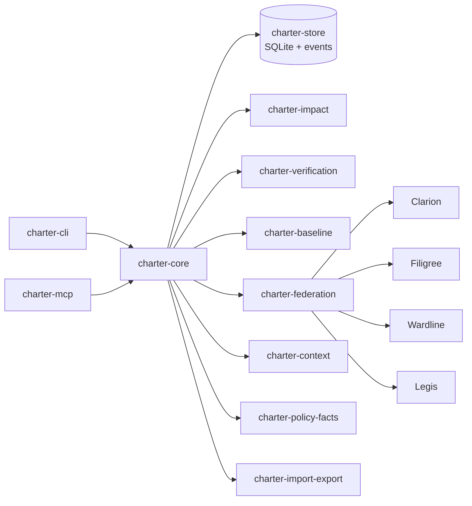

# Charter Planning Pack

## 1. Executive Summary

Charter is the fifth Loom federation tool: a local-first requirements,
traceability, verification, and impact-analysis authority for agentic
development. Its job is to state obligations and keep their satisfaction
evidence current enough for coding agents to act without turning a small project
into an enterprise ALM deployment.

The product line remains:

```text
Clarion understands the code.
Filigree tracks the work.
Wardline checks the trust.
Charter states the obligations.
Legis governs the boundary.
```

Future scoped-change execution tools, including Shuttle if it enters Loom, are
out of scope for Charter's v0.1 planning. Charter may eventually provide
obligations and verification targets to such a tool, but Charter does not own
execution transactions or rollback provenance.

The smallest useful Charter stores approved requirements, their versions,
acceptance criteria, manual trace links, verification records, baselines, and
impact reports in a repo-local `.charter/` directory. Its first killer workflow
is not "requirements database"; it is: "Before I change this code, tell me which
obligations I am about to touch, what evidence will go stale, and what work
should be created."

Charter must be agent-first. MCP and JSON CLI output are first-class interfaces.
Human output is concise, but agents should never need to scrape prose to answer
basic questions.

## 2. Product Intent And Authority Boundary

### Product Intent

Charter answers:

> What must be true, how do we know it is true, what code or work claims to
> satisfy it, and what requirements are impacted by this change?

It is "DOORS-lite" for Loom: enough structure for traceability, baselines,
verification, and impact analysis; not an enterprise ALM clone.

### Charter Owns

- Requirements and immutable approved requirement versions.
- Requirement decomposition and requirement-to-requirement links.
- Acceptance criteria.
- Verification methods and verification evidence records.
- Requirement baselines.
- Trace links between requirements, tests, code entities, issues, findings, and
  external references.
- Satisfaction and freshness facts.
- Requirement impact analysis.
- Requirement dossiers and session context.

### Charter Does Not Own

- Code identity, code graph, summaries, or SEI: Clarion owns these.
- Issue lifecycle, claims, ready work, dependencies, or sprint planning:
  Filigree owns these.
- Trust-boundary analysis, taint propagation, findings, waivers, or baselines:
  Wardline owns these.
- Git/CI gate decisions, sign-offs, attestations, or override trails:
  Legis owns these.
- Transactional scoped change execution and rollback provenance: these belong
  outside Charter, to a future scoped-change execution authority if one enters
  Loom.
- External ALM truth when Charter runs in adapter mode.

### Assumed Install Combinations

Charter must work in all of these modes:

- Standalone.
- With any one peer: Clarion, Filigree, Wardline, or Legis.
- With Clarion + Filigree, Clarion + Wardline, or Filigree + Wardline.
- With Clarion + Filigree + Wardline.
- With all four existing peers including Legis.

### Deliberately Out Of Scope

- Mandatory cloud service or account.
- Shared Loom runtime, registry, or database.
- Role-based access control beyond local filesystem boundaries.
- Certified ALM system-of-record claims.
- Commit blocking inside Charter.
- LLM-produced facts treated as accepted truth without acceptance.
- Automatic requirement extraction as a v0.1 requirement.
- Secure storage beyond ordinary filesystem and repository protections.

### Local Security Boundary

Charter stores requirements, traces, baselines, and verification evidence in the
local repository by default. It does not encrypt, sandbox, redact, or
access-control that data beyond normal filesystem permissions and whatever
protections the repository and host already provide. Do not store regulated,
classified, customer-sensitive, or confidential requirements in Charter unless
the repository, host, backups, and collaboration workflow are already protected
appropriately.

## 3. Senior User Interview

### Persona

**Senior User** is a senior developer and systems engineer who uses coding
agents daily. They build regulated-adjacent systems where traceability matters,
but they reject heavyweight ALM process unless it directly improves engineering
flow. They use CLI tools, MCP, local SQLite-backed systems, and git-native
workflow. They want agents to do the bookkeeping but not fabricate certainty.

### Structured Interview

| Question | Senior User Answer |
|---|---|
| How would you use Charter MCP on its own? | "I want the agent to ask: what requirements are approved, what is unverified, and what changed since the last baseline. I also want it to create draft requirements and proposed links while I am coding, but it must not silently mark a trace accepted." |
| How would you use Charter with Filigree? | "If Charter finds a verification gap, I want a Filigree task in one command. But Filigree should still own claim and lifecycle. Charter can say the gap exists and create candidate work." |
| How would you use Charter with Clarion? | "This is the main reason I would use it. A requirement linked to `auth.validate_token` should survive a rename. If code moves, Charter should show me the SEI lineage status and whether evidence is stale." |
| How would you use Charter with Wardline? | "Security requirements should be able to say: this acceptance criterion is violated by an active Wardline finding. Waived findings should not vanish; they should show as waived and still influence risk posture." |
| How would you use Charter with Clarion + Filigree + Wardline? | "Give me one requirement dossier: linked entity, open implementation work, active trust findings, verification status, and next action. I do not want four separate tool calls unless I am drilling down." |
| What do you expect when Legis is installed? | "In Chill mode I do not want a hard block by default. I want preflight to say: this commit touches high-criticality requirements, these tests are stale or missing, these Wardline findings affect them, and these issues are still open." |
| Which actions belong in MCP versus CLI? | "MCP should cover all agent actions: search, dossier, impact, propose links, record evidence, create gaps, create Filigree work. CLI should cover the same core actions for humans and scripts, with `--json` for agents." |
| What outputs must be machine-readable? | "Everything that an agent or Legis consumes: dossiers, impacts, trace links, gaps, verification records, baseline status, federation diagnostics, and preflight facts." |
| What outputs must be comfortable for humans? | "Impact summaries, missing verification reports, baseline diff, requirement show, and trace tree. Keep it dense, like a good compiler diagnostic, not a dashboard pitch." |
| What would make Charter too bureaucratic? | "Mandatory acceptance criteria on every draft, required human approval for low-risk links, huge workflow state machines, and turning every code change into a formal change request." |
| What would make Charter too weak? | "If links rot on rename, if stale evidence is not obvious, if agents can mark their own guesses as accepted, or if baseline conformance is just a static export." |

### Product Implications

- Charter must separate `proposed`, `accepted`, `inferred`, `imported`, and
  `stale` facts everywhere.
- Agent-proposed traceability is valuable, but accepted traceability is a
  different authority state.
- SEI-backed code links are the first high-value federation workflow.
- Filigree integration should create work from gaps, not move issue state.
- Wardline findings should remain visible even when waived or suppressed.
- Legis Chill integration should produce a single-shot fault-and-context report,
  not just "pass/fail".
- Human-readable output should resemble compiler diagnostics and git porcelain:
  compact, specific, and file/entity aware.

## 4. Product Implications From Interview

1. **False certainty is the central product risk.** Charter must never collapse
   proposed/inferred traceability into accepted traceability.
2. **The first "wow" moment is impact analysis.** Requirement storage is table
   stakes; "this pending diff stales these obligations" is the product.
3. **MCP parity is required.** Anything a human can do through CLI that an agent
   reasonably needs must have MCP coverage.
4. **No mandatory process wall.** Charter can advise, create gaps, and feed
   Legis; it must not become the gate.
5. **A stale fact is still useful.** Do not hide stale/waived/orphaned facts.
   Label them and explain their consequence.

## 5. Domain Model

| Concept | Purpose | Key Fields | Lifecycle | Authority | Agent Create Policy |
|---|---|---|---|---|---|
| Requirement | States an obligation. | `id`, `stable_id`, `title`, `statement`, `type`, `criticality`, `status`, `source`, `owner` | `draft -> approved -> superseded/deprecated`; rejected drafts may be archived. | Charter | Agents may create drafts. Approval may require human depending on policy. |
| Requirement Version | Immutable approved snapshot. | `requirement_id`, `version`, `statement_hash`, `approved_at`, `approved_by` | Born on approval or supersede; never mutated. | Charter | Agents cannot directly create accepted versions except through approve workflow. |
| Acceptance Criterion | Concrete satisfaction condition. | `id`, `requirement_id`, `statement`, `status`, `required` | Draft with requirement; approved when parent version approved. | Charter | Agents may create draft/proposed criteria; high-criticality acceptance follows policy. |
| Verification Method | Defines how satisfaction is shown. | `id`, `requirement_id`, `method`, `target`, `expected_result` | Proposed or accepted; may be retired. | Charter | Agents may propose; may accept test-derived methods if policy allows. |
| Verification Evidence | Records an observed verification result. | `id`, `requirement_id`, `version`, `method`, `evidence_ref`, `status`, `freshness`, `commit`, `recorded_by` | `current -> stale`; may be replaced by newer evidence. | Charter | Agents may record evidence with provenance; cannot fake external/manual attestation. |
| Trace Link | Connects two facts. | `id`, `from`, `to`, `relation`, `authority`, `confidence`, `freshness`, `content_hash_at_link` | Proposed, accepted, rejected, stale, orphaned. | Charter owns link state; target authority remains external when target is peer fact. | Agents may create low-risk accepted links only by policy; default is propose. |
| Baseline | Named set of requirement versions. | `id`, `name`, `created_at`, `members`, `locked`, `source` | Draft baseline may be edited; locked baseline immutable. | Charter | Agents may propose baselines; lock normally human-accepted. |
| Requirement Dossier | One-call agent summary. | Requirement, traces, evidence, gaps, peer facts, next actions. | Computed at read time from current facts. | Charter composes facts; peer authorities own peer facts. | Agents read only. |
| Impact Report | Explains affected requirements for diff/range/entity/requirement. | `scope`, `touched_requirements`, `nearby_requirements`, `stale_evidence`, `gaps`, `preflight_facts` | Computed; may be archived as evidence. | Charter | Agents can generate; recording requires explicit command. |
| Gap | Actionable missing or stale obligation. | `id`, `kind`, `requirement_id`, `severity`, `message`, `suggested_action`, `status` | `open -> linked_to_work -> resolved/waived`; waiver is labelled. | Charter owns gap fact; Filigree owns work item if created. | Agents may create detected gaps; resolving requires evidence or acceptance. |
| Proposed Link | Trace link not yet accepted. | Same as trace link plus `proposal_reason`, `proposed_by`. | `proposed -> accepted/rejected/stale`. | Charter | Agents may create freely with confidence and evidence. |
| Accepted Link | Trace link accepted as project truth. | Same as trace link plus `accepted_by`, `accepted_at`. | `accepted -> stale/orphaned/rejected_by_revision`. | Charter | Agents may accept only when policy allows; default high-risk acceptance is human. |
| Stale Link | Link whose target or basis changed. | `stale_reason`, `detected_at`, `current_target_state` | May be refreshed, accepted again, or rejected. | Charter | Agents may mark stale deterministically; may propose refresh. |

## 6. Internal Subsystem Architecture



| Subsystem | Responsibility | Inputs | Outputs | Key Interfaces | Failure Modes | Deterministic | LLM-Assisted |
|---|---|---|---|---|---|---|---|
| `charter-core` | Domain rules, lifecycle, validation, authority states. | CLI/MCP calls, store rows. | Domain objects, errors. | Python service API. | Invalid transition, duplicate IDs, policy conflict. | All lifecycle decisions. | No. |
| `charter-store` | Repo-local persistence, migrations, transactions. | Domain mutations. | SQLite rows, events, snapshots. | `CharterStore`, migration runner. | DB locked, schema mismatch, corrupt event log. | All writes and queries. | No. |
| `charter-cli` | Human/script surface. | Args, config, cwd. | Text or JSON. | `charter ... --json`. | Missing project, invalid args, peer outage. | Command semantics. | No. |
| `charter-mcp` | Agent-native structured surface. | MCP requests. | JSON tool responses. | stdio MCP server. | Tool validation error, actor missing, stale peer. | Tool schemas and outputs. | No. |
| `charter-federation` | Peer discovery and adapters. | Config, environment, peer probes. | Peer capabilities, imported facts. | Clarion/Filigree/Wardline/Legis clients. | Peer absent, version mismatch, auth failure. | Capability detection and degradation. | No. |
| `charter-impact` | Requirement impact over diffs, entities, tests, and traces. | Git diff/range, trace graph, peer entity data. | Impact reports and gaps. | `impact_pending`, `impact_range`. | Git unavailable, unknown entity, orphaned SEI. | Impact classification. | Optional link suggestions only. |
| `charter-baseline` | Baseline creation, lock, diff, verification status. | Requirement versions, verification records. | Baseline status reports. | `baseline_create`, `baseline_diff`. | Locked baseline mutation, missing version. | Baseline membership/diff. | No. |
| `charter-verification` | Evidence recording, freshness checks, test result import. | Evidence refs, commits, JUnit/JSON. | Verification records, stale marks. | `verification_record`, importers. | Evidence missing, test disappears, commit mismatch. | Freshness and status derivation. | Optional summary text only. |
| `charter-import-export` | Markdown/YAML/JSON/CSV import and export. | Files, external exports. | Requirements, links, reports. | Import/export commands and MCP tools. | Ambiguous IDs, unsupported schema. | Parsing and provenance. | Optional mapping proposals only. |
| `charter-context` | Generated `.charter/context.md` and session summary. | Store state, gaps, active baseline. | Compact context.md and JSON context. | `session_context`. | Generation failure, oversized context. | Selection and freshness stamps. | Optional prose compression, labelled. |
| `charter-events` | Append-only mutation event stream. | Mutations and imports. | `events` rows/JSONL. | `events_since`. | Event write failure, partial mutation. | Event emission. | No. |
| `charter-policy-facts` | Advisory facts for Legis and local reports. | Impact, verification, trace gaps. | Preflight facts; Charter findings. | `preflight_facts`. | Conflicting severity rules. | Fact derivation. | No gating decisions. |

## 7. Federation Interface Map

| Pairing | Capability Unlocked | Data Exchanged | Authority Direction | Tools/Calls | Events | Degradation | Charter Must Never Assume |
|---|---|---|---|---|---|---|---|
| Standalone | Requirements, manual traces, baselines, evidence, local impact. | Local files, tests, git diff paths. | Charter only. | CLI/MCP local. | `requirement.*`, `trace.*`, `verification.*`. | Full local operation. | That file/symbol links are stable. |
| Charter + Clarion | SEI-backed traces and entity-neighborhood impact. | Entity search, SEI, lineage, callers/callees, subsystem. | Clarion owns identity; Charter owns links. | Clarion MCP/HTTP: `find_entity`, `entity_at`, `neighborhood`, `resolve_sei`. | `trace.bound_entity`, `trace.orphaned`. | Fragile file/symbol links with warnings. | Never derive or parse SEI. |
| Charter + Filigree | Gaps become tracked work. | Issue IDs, status, labels, work links. | Filigree owns issue lifecycle; Charter owns gap. | Filigree MCP/CLI/HTTP issue create/link. | `gap.work_created`, `issue.linked`. | Show gaps without work creation. | Never infer issue closure means verification passed. |
| Charter + Wardline | Requirements tied to trust findings. | Finding fingerprints, status, severity, waiver/suppression state. | Wardline owns analysis; Charter owns requirement effect. | Wardline JSONL/SARIF/MCP; optional Filigree finding link. | `finding.linked`, `requirement.unsatisfied_by_finding`. | Requirements show no live trust facts. | Never rerun or reinterpret taint analysis as Charter truth. |
| Charter + Legis | Requirement facts in preflight/governance. | Impact facts, stale evidence, baseline status, trace gaps. | Legis owns gate; Charter owns facts. | Legis preflight fact provider. | `preflight.facts_exported`, `attestation.reference_recorded`. | Local advisory reports only. | Never decide commit allow/block. |
| Charter + Clarion + Filigree | Entity-linked requirements create precise work. | SEI, issue IDs, requirement gaps. | Clarion identity; Filigree lifecycle; Charter obligation. | `impact_pending_diff` -> `gap_create_work`. | `gap.work_created` with SEI refs. | Fall back to manual gap reports. | Never route Clarion/Filigree through a hidden third peer. |
| Charter + Clarion + Wardline | Security requirement dossier over structure and trust. | SEI, neighborhood, Wardline finding metadata. | Clarion identity; Wardline analysis; Charter obligation. | Dossier joins peer facts by SEI/fingerprint. | `finding.requirement_link_proposed`. | Show findings as external refs only. | Never claim absence of findings means requirement satisfied unless scan freshness is known. |
| Charter + Filigree + Wardline | Findings become requirements-linked work. | Finding fingerprints, issue IDs, gap IDs. | Wardline finding; Filigree work; Charter gap. | Wardline emit/read + Filigree create/link. | `gap.created_from_finding`, `gap.work_created`. | Keep finding link and gap local. | Never close findings when work closes. |
| Charter + Clarion + Filigree + Wardline | Full requirement dossier for code, work, and trust. | SEI, issues, findings, verification. | Peer authority remains separated. | `dossier_requirement`, `impact_pending_diff`. | Dossier read has no mutation; stale events separately. | Omit absent peer sections with capability stamps. | Never make suite mode required for dossier. |
| Charter + all peers | Chill/Coached/Structured/Protected governance using Charter facts. | Preflight facts and optional sign-off references. | Legis governs; Charter supplies facts. | `preflight_facts_export`, Legis intake. | `preflight.facts_exported`, `signoff.reference_recorded`. | Advisory only when Legis absent. | Never treat Legis sign-off as Charter verification evidence unless explicitly linked. |

## 8. Capability Matrix By Installed Tools

| Installed Tools | First Useful Workflow | Output |
|---|---|---|
| Charter | Track approved requirements and missing verification. | Missing/stale verification report. |
| Charter + Clarion | Link requirements to SEI and survive code movement. | Entity-aware impact report. |
| Charter + Filigree | Turn requirement gaps into local work items. | Filigree tasks linked to gaps. |
| Charter + Wardline | Show security requirements violated by active findings. | Requirement dossier with trust posture. |
| Charter + Legis | Add requirement risk to commit preflight. | Chill preflight fact block. |
| Charter + Clarion + Filigree | Create precise implementation/verification work from entity impact. | Issue set tied to affected requirements and SEIs. |
| Charter + Clarion + Wardline | Explain which trusted code paths violate obligations. | Security obligation dossier. |
| Charter + Filigree + Wardline | Promote findings into requirement-linked work. | Gap -> issue -> finding trace. |
| Charter + Clarion + Filigree + Wardline | One-call obligation/code/work/trust dossier. | Agent-ready requirement mastery read. |
| Charter + all peers | Preflight report with obligations, work, trust, and governance context. | Legis fact envelope plus human summary. |

### Specific Design Questions Answered

| Question | Decision |
|---|---|
| Smallest useful standalone | Requirements, versions, criteria, manual traces, evidence, baselines, context, and path/test-based impact. |
| First Clarion killer workflow | `charter link --entity` resolves to SEI; pending diff reports affected requirements and stale evidence after rename/move. |
| First Filigree killer workflow | `charter gaps --create-work` creates verification/trace tasks without owning lifecycle. |
| First Wardline killer workflow | Active or waived findings appear in requirement dossiers and can create proposed links/gaps. |
| Legis Chill facts | Impacted requirements, criticality, stale/missing evidence, active/waived findings, open linked work, baseline drift, trace gaps. |
| Agent-created links | Draft requirement links, test links for uncritical requirements, external reference links, proposed entity/finding/issue links. |
| Links needing acceptance | High/safety/security entity links, finding-to-requirement violation links, baseline membership, manual attestation links. |
| Stale verification detection | Requirement version change, linked entity content hash change, linked test missing/changed, evidence commit older than touched commit. |
| Lightweight baselines | Locked list of approved requirement versions plus computed verification status; no heavyweight release workflow. |
| Requirement to tests | Store test selector/path and optional test result import; mark stale if selector disappears or requirement version changes. |
| Requirement to SEI | Store opaque SEI plus locator snapshot and content hash/freshness metadata. |
| Requirement to issue | Store Filigree issue ID and optional project key; display issue status but do not derive satisfaction from closure. |
| Requirement to finding | Store Wardline fingerprint and scan source; display status including waived/suppressed/stale. |
| Code moves/renames | Resolve by SEI when available; if lineage alive, keep link; if orphaned, mark link stale/orphaned and create gap. |
| Requirement changes | New approved version; evidence and links tied to prior version become stale unless explicitly carried forward. |
| Linked test disappears | Mark verification stale/missing and create verification gap. |
| Wardline finding waived | Requirement impact records `waived_finding`; satisfaction depends on accepted waiver policy, not disappearance. |
| Filigree issue closes but verification stale | Keep Charter gap open or reopen-equivalent locally; optionally create follow-up Filigree verification task. |

## 9. MCP Interface Proposal

### Tool Groups

MCP names use `requirement_*`, `trace_*`, `verification_*`, `baseline_*`,
`impact_*`, `gap_*`, `federation_*`, and `session_*`. Mutation tools require an
`actor` argument or an authenticated MCP session actor.

| Tool | Purpose | Input Sketch | Output Sketch | Mutates | Human Acceptance | Agent Use |
|---|---|---|---|---|---|---|
| `requirement_get` | Fetch requirement. | `{id, version?}` | `RequirementDossier?` or `Requirement` | No | No | Read exact obligation. |
| `requirement_search` | Search/filter requirements. | `{query?, status?, type?, criticality?, limit?, offset?}` | `{items, has_more}` | No | No | Find relevant obligations. |
| `requirement_create` | Create draft requirement. | `{title, statement, type?, criticality?, rationale?, source?, actor}` | `Requirement` | Yes | No for draft | Draft requirement from discussion. |
| `requirement_update` | Edit draft. | `{id, fields, actor}` | `Requirement` | Yes | No for draft | Refine wording. |
| `requirement_approve` | Approve version. | `{id, actor}` | `RequirementVersion` | Yes | Policy-dependent | Human or policy-approved agent locks version. |
| `requirement_supersede` | Create successor version. | `{id, statement, rationale?, actor}` | `Requirement` | Yes | Policy-dependent | Update changed obligation. |
| `criterion_add` | Add acceptance criterion. | `{requirement_id, statement, required?, actor}` | `AcceptanceCriterion` | Yes | Policy-dependent | Clarify satisfaction. |
| `criterion_list` | List criteria. | `{requirement_id, version?}` | `{items}` | No | No | Check test target. |
| `trace_link_create` | Create accepted trace link when allowed. | `{from, to, relation, authority, evidence?, actor}` | `TraceLink` | Yes | Yes if policy requires | Add manual accepted link. |
| `trace_link_propose` | Propose link. | `{from, to, relation, confidence, reason, actor}` | `ProposedLink` | Yes | Later | Agent suggests entity/test/finding link. |
| `trace_link_accept` | Accept proposal. | `{link_id, actor}` | `TraceLink` | Yes | Yes | Promote proposed link. |
| `trace_link_reject` | Reject proposal. | `{link_id, reason?, actor}` | `TraceLink` | Yes | Yes | Remove false link. |
| `trace_for` | Show forward/back trace. | `{id, direction?, include_stale?}` | `{nodes, links}` | No | No | Build trace tree. |
| `trace_gaps` | Find missing/stale traces. | `{scope?, criticality?, baseline?}` | `{items}` | No | No | Discover work. |
| `verification_record` | Record evidence. | `{requirement_id, method, evidence_ref, status, commit?, actor}` | `VerificationRecord` | Yes | Manual attestation yes | Attach test/JUnit/inspection result. |
| `verification_status` | Read status. | `{requirement_id, baseline?}` | `VerificationStatus` | No | No | Determine if satisfied. |
| `verification_missing` | List missing evidence. | `{scope?, baseline?}` | `{items}` | No | No | Find verification gaps. |
| `verification_stale` | List stale evidence. | `{scope?, reason?}` | `{items}` | No | No | Preflight/check work. |
| `verification_import_junit` | Import test result evidence. | `{path, actor, dry_run?}` | `{imported, proposed_links, warnings}` | Yes unless dry-run | Link acceptance policy | Convert tests to evidence. |
| `baseline_create` | Create baseline. | `{name, description?, include?, actor}` | `Baseline` | Yes | Lock policy | Snapshot approved reqs. |
| `baseline_lock` | Lock baseline. | `{baseline_id, actor}` | `Baseline` | Yes | Usually yes | Release baseline. |
| `baseline_diff` | Compare baseline. | `{baseline_id, target?}` | `BaselineDiff` | No | No | See changed obligations. |
| `baseline_status` | Verification vs baseline. | `{baseline_id}` | `BaselineStatus` | No | No | Release readiness. |
| `impact_pending_diff` | Impact of working tree. | `{include_neighborhood?, baseline?}` | `ImpactReport` | No | No | Before editing/commit. |
| `impact_commit_range` | Impact of commit range. | `{base, head, include_neighborhood?, baseline?}` | `ImpactReport` | No | No | Review PR/range. |
| `impact_requirement` | Impact of changing requirement. | `{requirement_id, proposed_statement?}` | `ImpactReport` | No | No | Assess requirement change. |
| `gap_list` | List gaps. | `{status?, kind?, criticality?}` | `{items}` | No | No | Plan next work. |
| `gap_create_work` | Create Filigree work from gap. | `{gap_id, issue_type?, actor}` | `{gap, issue_ref}` | Yes | No if Filigree policy allows | Turn gap into tracked task. |
| `dossier_requirement` | One-call requirement summary. | `{id, include_peer_facts?}` | `RequirementDossier` | No | No | Agent orientation. |
| `federation_status` | Probe peers. | `{}` | `{peers, capabilities}` | No | No | Decide enriched workflow. |
| `federation_resolve_entity` | Resolve locator to SEI via Clarion. | `{locator}` | `{sei?, locator, freshness, warnings}` | No | No | Prepare proposed entity link. |
| `preflight_facts` | Facts for Legis. | `{scope, base?, head?}` | `LegisPreflightFacts` | No | No | Feed Chill/Coached preflight. |
| `session_context` | Compact project summary. | `{since?, include_gaps?}` | `SessionContext` | No | No | Startup orientation. |
| `events_since` | Event stream. | `{since, limit?}` | `{items, has_more}` | No | No | Resume agent session. |

## 10. CLI Interface Proposal

CLI must be first-class, with `--json` on agent-used commands. Text output is
dense and stable enough for humans, but JSON is the contract for agents.

### v0.1 Command Contract

The v0.1 implementation contract is intentionally smaller than the long-range
product surface:

```text
charter init [--project-key AUTH] [--json]
charter doctor [--json]

charter req add
charter req edit
charter req approve
charter req supersede
charter req deprecate
charter req show
charter req search

charter criterion add
charter criterion list

charter trace propose
charter trace accept
charter trace reject
charter trace list
```

Deferred commands include install/mcp wiring, verification, baselines, impact,
dossiers, gaps, import/export, context/events, and federation commands.

### Important Human Output Examples

`charter impact --since main`

```text
Requirement impact for main...HEAD

Touched:
  REQ-AUTH-017  high/security  verification stale
    entity: clarion:eid:... auth.validate_token
    evidence: tests/test_auth.py::test_expired_token_rejected last run at abc123

Nearby:
  REQ-AUTH-014  medium/security  current
    reason: caller of touched entity

Gaps:
  GAP-0007  stale_verification  REQ-AUTH-017
    run or replace evidence for expired-token rejection
```

`charter baseline status release-1.0`

```text
Baseline release-1.0
  requirements: 42 approved versions
  verified current: 38
  stale: 3
  missing: 1

Blocking gaps by policy:
  REQ-SAFE-003 missing current verification
```

`charter federation status`

```text
Federation peers
  Clarion   present  capabilities: sei, entity_at, neighborhood
  Filigree  present  capabilities: issue_create, issue_link
  Wardline  absent
  Legis     absent
```

## 11. Core Workflows

### v0.1 Standalone Requirement Authoring

1. `charter req add --title "Reject expired bearer tokens" --statement "... expired bearer tokens ..." --actor human:john --json`
2. `charter criterion add REQ-AUTH-017 "... receives HTTP 401 ..."`
3. `charter req approve REQ-AUTH-017 --actor human:john --expected-version 0 --json`
4. `charter req show REQ-AUTH-017 --json`

Verification records and baselines are deferred beyond v0.1.

### Agent Proposes Trace Links

1. Agent reads `dossier_requirement`.
2. Agent calls `federation_resolve_entity` or searches tests.
3. Agent calls `trace_link_propose` with confidence and evidence.
4. Charter records `trace.proposed`.
5. Human or policy calls `trace_link_accept` or `trace_link_reject`.

### Human Accepts Or Rejects Links

1. `charter gaps --kind proposed_link`
2. `charter trace REQ-AUTH-017 --include-proposed`
3. `charter accept-link LINK-42` or `charter reject-link LINK-42 --reason "wrong layer"`

### Requirement Change Impact Analysis

1. Draft a new statement with `impact_requirement`.
2. Charter finds child requirements, accepted trace links, evidence tied to old
   version, and linked work.
3. Charter reports stale evidence and needed review tasks.
4. If approved, `requirement_supersede` creates new immutable version.

### Pending Diff Impact Analysis

1. Charter reads git diff paths.
2. If Clarion present, maps changed paths/lines to entities and SEI.
3. Traverses accepted links from files/entities/tests to requirements.
4. Marks stale evidence where content hash/commit/test changed.
5. Emits impact report and optional Legis facts.

### Verification Evidence Recording

1. `verify-run` imports JUnit or JSON test result.
2. Existing test trace links map results to requirements.
3. New test selectors create proposed links when no accepted link exists.
4. Passing evidence is current for the requirement version and commit.

### Stale Verification Detection

Triggers:

- Requirement version changes.
- Linked SEI content hash changes.
- Linked test file or selector disappears.
- Linked test changes after last verified commit.
- Wardline finding linked to acceptance criterion changes active/waived status.

### Filigree Work Creation From Charter Gaps

1. `gap_list` shows missing/stale verification.
2. `gap_create_work` creates Filigree issue with Charter gap ID, requirement ID,
   and evidence target.
3. Charter records issue link.
4. Issue closure does not close the Charter gap unless evidence is recorded.

### Clarion Entity Binding

1. User or agent names symbol/file/line.
2. Charter resolves through Clarion.
3. Charter stores opaque SEI, locator snapshot, and content hash/freshness.
4. If Clarion later reports orphaned SEI, Charter marks link stale/orphaned and
   creates a trace gap.

### Wardline Finding To Requirement Mapping

1. Wardline finding has fingerprint, rule, severity, entity metadata.
2. Charter proposes link to security/trust requirement.
3. Accepted link can mark requirement unsatisfied while finding is active.
4. Waived finding remains visible as `waived`, not `absent`.

### Legis Chill Preflight Contribution

1. Legis asks Charter for `preflight_facts`.
2. Charter returns impacted requirements, criticality, baseline drift, stale or
   missing evidence, trace gaps, linked work status, and relevant Wardline
   findings.
3. Legis displays or governs according to its configured mode.
4. Charter records export event but does not decide pass/fail.

## 12. Data Model And Storage Sketch

### Storage Layout

```text
.charter/
  charter.db
  charter.yaml
  context.md
  events.jsonl
  baselines/
  exports/
  imports/
```

### Database Tables

```text
requirements(
  id, stable_id, current_version, title, statement, rationale,
  type, criticality, status, owner, source, created_at, updated_at
)

requirement_versions(
  requirement_id, version, title, statement, rationale, statement_hash,
  approved_at, approved_by, supersedes_version
)

acceptance_criteria(
  id, requirement_id, requirement_version, statement, status, required
)

verification_methods(
  id, requirement_id, requirement_version, method, target, expected_result,
  authority, status
)

verification_records(
  id, requirement_id, requirement_version, method_id, method, evidence_ref,
  evidence_type, status, freshness, last_verified_at, last_verified_commit,
  verifier, notes
)

trace_links(
  id, from_kind, from_id, to_kind, to_id, relation, authority, confidence,
  freshness, proposed_by, accepted_by, created_at, accepted_at,
  stale_reason, target_snapshot_json
)

baselines(id, name, description, status, created_at, locked_at, created_by)
baseline_members(baseline_id, requirement_id, requirement_version)

gaps(id, kind, requirement_id, severity, message, status, suggested_action,
     source, linked_issue_id, created_at, resolved_at)

events(id, timestamp, actor, event_type, subject_kind, subject_id,
       before_json, after_json)

peer_cache(peer, capability, observed_at, status, details_json)
```

### Config Shape

```yaml
project:
  key: AUTH
  requirement_prefix: REQ

storage:
  path: .charter/charter.db

federation:
  clarion: auto
  filigree: auto
  wardline: auto
  legis: auto

traceability:
  allow_agent_proposed_links: true
  require_human_acceptance_for:
    - high
    - safety
    - security

verification:
  stale_on_requirement_change: true
  stale_on_linked_entity_change: true
  stale_on_test_change: true

baselines:
  require_approved_only: true
```

### Event Types

- `requirement.created`
- `requirement.updated`
- `requirement.approved`
- `requirement.superseded`
- `criterion.added`
- `trace.proposed`
- `trace.accepted`
- `trace.rejected`
- `trace.marked_stale`
- `verification.recorded`
- `verification.marked_stale`
- `baseline.created`
- `baseline.locked`
- `gap.created`
- `gap.resolved`
- `federation.peer_observed`
- `preflight.facts_exported`
- `import.completed`
- `export.completed`

### Peer Discovery

Discovery is bilateral and optional:

1. Read `charter.yaml`.
2. Probe conventional local config files where appropriate.
3. Probe known local CLI commands only when configured or discoverable.
4. Probe MCP/HTTP endpoints when explicitly configured.
5. Record capabilities and freshness. Absence is a normal state.

## 13. JSON Contract Sketches

### Requirement Dossier

```json
{
  "requirement": {
    "id": "REQ-AUTH-017",
    "version": 3,
    "title": "Reject expired bearer tokens",
    "status": "approved",
    "type": "security",
    "criticality": "high"
  },
  "freshness": "current",
  "acceptance_criteria": [],
  "verification": {
    "overall": "stale",
    "records": []
  },
  "trace_links": [],
  "peer_facts": {
    "clarion": {"status": "present", "entities": []},
    "filigree": {"status": "present", "issues": []},
    "wardline": {"status": "absent", "findings": []},
    "legis": {"status": "absent", "attestations": []}
  },
  "gaps": [],
  "suggested_actions": []
}
```

### Requirement Impact Report

```json
{
  "scope": {"kind": "pending_diff", "base": "main", "head": "WORKTREE"},
  "generated_at": "2026-06-04T10:00:00+10:00",
  "touched_requirements": [],
  "nearby_requirements": [],
  "stale_verification": [],
  "missing_verification": [],
  "trace_gaps": [],
  "preflight_severity": "warn",
  "warnings": []
}
```

### Trace Link

```json
{
  "id": "LINK-42",
  "from": {"kind": "requirement", "id": "REQ-AUTH-017", "version": 3},
  "to": {"kind": "clarion_entity", "id": "clarion:eid:abc"},
  "relation": "implemented_by",
  "authority": "agent_proposed",
  "confidence": 0.86,
  "freshness": "current",
  "target_snapshot": {"locator": "auth.validate_token", "content_hash": "sha256:..."}
}
```

### Verification Record

```json
{
  "id": "VER-AUTH-017-1",
  "requirement_id": "REQ-AUTH-017",
  "requirement_version": 3,
  "method": "test",
  "evidence_ref": "tests/test_auth.py::test_expired_token_rejected",
  "status": "passing",
  "freshness": "current",
  "last_verified_commit": "abc123",
  "verifier": "agent:codex"
}
```

### Baseline Status

```json
{
  "baseline": {"id": "BASELINE-1.0", "status": "locked"},
  "requirements": {"total": 42, "changed_since": 2},
  "verification": {"current": 38, "stale": 3, "missing": 1},
  "gaps": []
}
```

### Requirement Gap

```json
{
  "id": "GAP-0007",
  "kind": "stale_verification",
  "requirement_id": "REQ-AUTH-017",
  "severity": "high",
  "message": "Linked entity changed after last verification",
  "suggested_action": "Run tests/test_auth.py::test_expired_token_rejected",
  "status": "open"
}
```

### Charter Facts For Legis Preflight

```json
{
  "producer": "charter",
  "scope": {"kind": "pending_diff"},
  "facts": [
    {
      "kind": "requirement_verification_stale",
      "requirement_id": "REQ-AUTH-017",
      "criticality": "high",
      "severity": "warn",
      "message": "Touched requirement has stale verification",
      "evidence": ["VER-AUTH-017-1"]
    }
  ],
  "summary": {"warn": 1, "block_candidate": 0}
}
```

Human-readable output is generated from these contracts, not treated as the
contract itself.

## 14. Feature Requirements

### Functional Requirements

- **CH-FR-001:** Charter shall create, edit, approve, supersede, deprecate,
  search, and show requirements.
- **CH-FR-002:** Charter shall preserve immutable approved requirement versions.
- **CH-FR-003:** Charter shall support acceptance criteria per requirement.
- **CH-FR-004:** Charter shall support verification methods and evidence records.
- **CH-FR-005:** Charter shall support manual, proposed, accepted, rejected,
  stale, and orphaned trace links.
- **CH-FR-006:** Charter shall create named baselines from approved requirement
  versions.
- **CH-FR-007:** Charter shall compare current requirements and verification to a
  baseline.
- **CH-FR-008:** Charter shall compute impact reports for pending diffs, commit
  ranges, requirements, and entities.
- **CH-FR-009:** Charter shall generate requirement dossiers.
- **CH-FR-010:** Charter shall generate `.charter/context.md`.
- **CH-FR-011:** Charter shall import Markdown, JSON, YAML, and CSV requirement
  data.
- **CH-FR-012:** Charter shall export Markdown, JSONL, CSV, and static report
  data.
- **CH-FR-013:** Charter shall record every mutation as an event.
- **CH-FR-014:** Charter shall create and track requirement gaps.
- **CH-FR-015:** Charter shall distinguish satisfaction from issue closure.

### Agent-First Requirements

- **CH-MCP-001:** Charter shall expose read/query/dossier tools over MCP.
- **CH-MCP-002:** Charter shall expose mutation tools over MCP with actor
  attribution.
- **CH-MCP-003:** Charter shall allow agents to propose trace links.
- **CH-MCP-004:** Charter shall return structured JSON for all MCP tools.
- **CH-MCP-005:** Charter shall expose impact and preflight fact tools over MCP.
- **CH-MCP-006:** Charter shall expose federation capability status over MCP.
- **CH-MCP-007:** Charter shall expose session context and event-resume tools.

### CLI Requirements

- **CH-CLI-001:** Charter shall provide `init`, `install`, `doctor`, and `mcp`.
- **CH-CLI-002:** Charter shall provide requirement lifecycle commands.
- **CH-CLI-003:** Charter shall provide trace, link, and gap commands.
- **CH-CLI-004:** Charter shall provide verification commands.
- **CH-CLI-005:** Charter shall provide baseline commands.
- **CH-CLI-006:** Charter shall provide impact and dossier commands.
- **CH-CLI-007:** Agent-used commands shall support `--json`.
- **CH-CLI-008:** Human output shall be concise and diagnostic.

### Federation Requirements

- **CH-FED-001:** Charter shall remain useful when all peers are absent.
- **CH-FED-002:** Charter shall use Clarion SEI when present and never derive it.
- **CH-FED-003:** Charter shall link to Filigree issues without owning issue
  lifecycle.
- **CH-FED-004:** Charter shall link to Wardline findings without owning analysis.
- **CH-FED-005:** Charter shall supply facts to Legis without making decisions.
- **CH-FED-006:** Charter shall degrade honestly when peers are absent or stale.
- **CH-FED-007:** Charter shall label peer facts with source, capability, and
  freshness.
- **CH-FED-008:** Charter shall avoid pipeline coupling through uninvolved peers.

## 15. Non-Functional Requirements

- **CH-NFR-001:** Charter shall be local-first and repo-local by default.
- **CH-NFR-002:** Charter shall require no cloud service or account.
- **CH-NFR-003:** Charter shall keep its deterministic core free from LLM-only
  decisions.
- **CH-NFR-004:** Charter shall label facts as current, stale, unknown, proposed,
  inferred, imported, or accepted.
- **CH-NFR-005:** Charter shall support thousands of requirements and trace links
  on ordinary developer hardware.
- **CH-NFR-006:** Charter shall use SQLite as the default local store.
- **CH-NFR-007:** Charter shall support schema migrations.
- **CH-NFR-008:** Charter shall keep base installation lightweight.
- **CH-NFR-009:** Charter shall avoid hidden authority takeover from peer tools.
- **CH-NFR-010:** Charter shall be auditable through append-only events.
- **CH-NFR-011:** Charter shall produce stable JSON contracts for agents and
  federation.
- **CH-NFR-012:** Charter shall preserve graceful degradation on peer failures.

## 16. MVP Scope

MVP must include:

- `charter init` and repo-local `.charter/` layout.
- SQLite schema and migrations.
- Requirement create/edit/approve/deprecate/show/search.
- Immutable approved versions.
- Acceptance criteria.
- Manual trace links and proposed/accepted distinction.
- Verification records.
- Requirement-change stale verification detection.
- Baselines and baseline diff/status.
- Path/test-based `charter impact`.
- JSON output for agent-used CLI commands.
- MCP read/query/dossier tools.
- Markdown and JSON import/export.
- Generated `.charter/context.md`.

MVP should include:

- Clarion SEI links when Clarion is installed.
- Filigree issue links and gap-to-work creation.
- Agent-proposed trace links.
- Pending diff impact report.

MVP may defer:

- Wardline finding integration.
- Legis preflight integration.
- External ALM adapters.
- Rich web UI.
- Deep test runner integration.
- LLM-assisted requirement decomposition.

## 17. v1.0 Scope

v1.0 should include:

- Robust requirement lifecycle and versioning.
- Accepted/proposed/rejected/stale trace links.
- Requirement dossiers over MCP and CLI.
- Clarion SEI federation.
- Filigree work creation from Charter gaps.
- Wardline finding links and requirement impact.
- Legis Chill preflight fact contribution.
- Baseline creation, lock, diff, and verification status.
- Verification freshness against requirement, test, and linked entity changes.
- Markdown, JSON, CSV, and JSONL import/export.
- Session context and event resumption.
- Documented federation contracts and fixtures.

## 18. Post-v1.0 Scope

- DOORS Next OSLC adapter.
- Polarion, Jama, Codebeamer, Jira/Confluence adapters.
- Static HTML reports.
- Graph visualization.
- Requirement quality linting.
- LLM-assisted requirement decomposition.
- LLM-assisted test suggestion.
- Assurance case support.
- Rich dashboard.
- Multi-project reporting.
- Signed baseline attestations via Legis.

## 19. ADR Candidates

1. **ADR-001: Charter authority boundary and Loom federation posture.**
2. **ADR-002: Requirement identity, human IDs, stable IDs, and versioning.**
3. **ADR-003: Trace link authority states and false-certainty prevention.**
4. **ADR-004: SQLite repo-local storage and event model.**
5. **ADR-005: CLI and MCP contract parity.**
6. **ADR-006: Clarion SEI consumer behavior.**
7. **ADR-007: Filigree gap-to-work integration without lifecycle takeover.**
8. **ADR-008: Wardline finding-to-requirement semantics including waived
   findings.**
9. **ADR-009: Legis preflight fact contract.**
10. **ADR-010: Baseline model and lock semantics.**
11. **ADR-011: Import/export provenance and external ALM adapter mode.**
12. **ADR-012: LLM assistance boundaries and provenance labels.**

## 20. Implementation Work Packages

| Work Package | Goal | Primary Acceptance |
|---|---|---|
| WP0 Repo Standardization | Complete scaffold, CI, docs folders. | `make ci` passes; package imports and version commands work. |
| WP1 Local Store | `.charter/`, SQLite schema, migrations, events. | `charter init` creates project; migrations idempotent. |
| WP2 Requirement Lifecycle | Core requirement/version commands and MCP reads. | Create/edit/approve/show/search with JSON. |
| WP3 Criteria And Trace Links | Criteria plus proposed/accepted trace model. | Agent can propose; human can accept/reject; trace tree works. |
| WP4 Verification | Methods, records, stale detection on requirement change. | Missing/stale/current verification reports work. |
| WP5 Baselines | Create, lock, diff, status. | Locked baseline is immutable and reportable. |
| WP6 Impact Engine | Path/test based impact, then Clarion-enriched impact. | Pending diff identifies touched requirements. |
| WP7 MCP Surface | Agent read/mutation/context tools. | MCP contract tests cover core tools. |
| WP8 Context And Events | `.charter/context.md`, events since timestamp. | Session startup and resume are supported. |
| WP9 Filigree Integration | Gap-to-work creation and issue linking. | Charter gap creates Filigree issue without closing gap. |
| WP10 Wardline Integration | Finding links and security requirement impact. | Active/waived findings appear in dossier. |
| WP11 Legis Integration | Chill preflight facts. | Legis can consume Charter fact JSON. |
| WP12 Import/Export | Markdown, JSON, CSV, JSONL. | Round-trip fixtures pass. |

## 21. Open Questions And Risks

### Open Questions

- What exact ID format should generated requirements use: project prefix only
  (`REQ-001`) or typed prefixes (`REQ-AUTH-001`)?
- Which trace links can be accepted automatically in low-criticality projects?
- Should Charter store test evidence by selector only, or also normalized test
  identity when test runners provide it?
- Should baseline lock require a human actor by default?
- What is the first supported Wardline input: raw JSONL, Filigree finding link,
  Wardline MCP, or all three?
- What is the minimum Legis preflight contract version Charter should target?
- Should external ALM adapter mode be read-only for v1.0?

### Risks

- **Bureaucracy creep:** too many mandatory states could make Charter feel like
  DOORS. Mitigation: drafts stay lightweight; policy controls strictness.
- **False certainty:** agents may over-link. Mitigation: proposed/accepted split
  is non-negotiable.
- **Authority bleed:** Charter may be tempted to treat issue closure or Wardline
  waiver as satisfaction. Mitigation: explicit non-overlap ADRs.
- **Peer version skew:** federation contracts may drift. Mitigation: capability
  probing and contract fixtures.
- **Stale-data invisibility:** users may ignore freshness. Mitigation: every
  dossier and preflight fact carries freshness labels.
- **Impact overreach:** early impact may be noisy. Mitigation: start with direct
  accepted links and add neighborhood expansion behind explicit flags.
